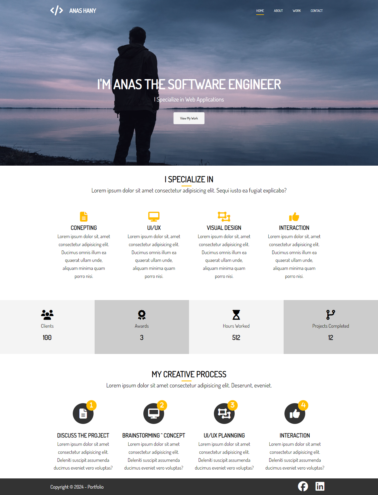

# Portfolio System

> Portfolio is a website.

## Table of contents

- [General info](#general-info)
- [Live Site](#live-site)
- [Screenshots](#screenshots)
- [Technologies](#technologies)
- [Setup](#setup)
- [Status](#status)
- [Inspiration](#inspiration)
- [Developing Notes](#Developing-Notes)
- [Contact](#contact)

## General info

Portfolio is made of four pages, i.e., Home, About, Work, and Contact.

## Live site
- the site is live at [Portfolio Website](https://portfolio-website.netlify.app/)

## Screenshots

## Technologies

- Html/CSS 3
- Transition
- Transform

## Setup

_no extra actions_

## Status

The project is _done_.

## Inspiration

Add here credits. The project was inspired by Brad Traversy, based on his course: "Modern HTML & CSS From The Beginning (Including Sass)".

## Developing Notes
> Creation Time: Feb 24 2024
> Project Total Time: 8 Hours 

## Contact
Created by [@Anoos](https://www.facebook.com/anashany219) - feel free to contact me!
